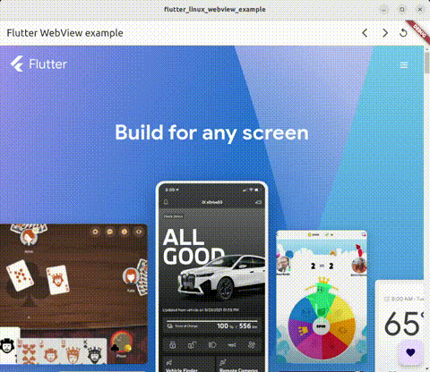
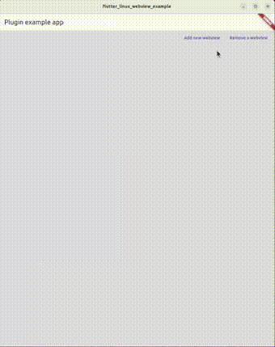

# flutter\_linux\_webview

The Linux Desktop implementation of the [webview_flutter](https://pub.dev/packages/webview_flutter/versions/3.0.4) (v3.0.4) plugin.

[webview_flutter](https://pub.dev/packages/webview_flutter/versions/3.0.4) is a [federated package](https://docs.flutter.dev/packages-and-plugins/developing-packages#federated-plugins), consisting of an app-facing package, platform interface package, and platform implementation packages.

This plugin package provides the Linux implementation for [webview_flutter](https://pub.dev/packages/webview_flutter/versions/3.0.4) (v3.0.4) and is powered by CEF (Chromium Embedded Framework).

Depending on the architecture, the following CEF binary distribution provided at https://cef-builds.spotifycdn.com/index.html is downloaded in the source directory of the plugin at the first build time:
- for x86_64: [cef_binary_96.0.18+gfe551e4+chromium-96.0.4664.110_linux64_minimal](https://cef-builds.spotifycdn.com/cef_binary_96.0.18%2Bgfe551e4%2Bchromium-96.0.4664.110_linux64_minimal.tar.bz2)
- for arm64: [cef_binary_96.0.18+gfe551e4+chromium-96.0.4664.110_linuxarm64_minimal](https://cef-builds.spotifycdn.com/cef_binary_96.0.18%2Bgfe551e4%2Bchromium-96.0.4664.110_linuxarm64_minimal.tar.bz2)

<!-- note: GitBucket does not seem to resolve relative paths; GitHub does. -->
<table>
  <tr>
    <td>  </td>
    <td>  </td>
  </tr>
</table>


# Supported Platforms

We have confirmed that this plugin works on some platforms but hangs or crashes on others.

See [validation_report.md](./validation_report.md) for details on how the plugin was validated on different platforms.

As the report results show, there are stability issues:
* WebView creation appears to be somewhat unstable.
* Using Flutter 3.16.3 (latest as of 2023-12-13), the plugin test hangs on all platforms.

We should fix these issues.


# Run the example project

Go to `example/`.

# Usage

## 1. Depend on it

Add `flutter_linux_webview:^0.1.0` and `webview_flutter:^3.0.4` as dependencies in your pubspec.yaml file.

Run these commands:

```sh
 $ flutter pub add flutter_linux_webview:'^0.1.0'
 $ flutter pub add webview_flutter:'^3.0.4'
```

This will add lines like this to your package's pubspec.yaml (and run an implicit flutter pub get):

```yaml
dependencies:
  webview_flutter: ^3.0.4
  flutter_linux_webview: ^0.1.0
```

## 2. Modify linux/CMakeLists.txt of your application

You need to add the following command to `linux/CMakeLists.txt` in your app:

```cmake
include(flutter/ephemeral/.plugin_symlinks/flutter_linux_webview/linux/cmake/link_to_cef_library.cmake)
```

but must be placed after the following string:

```cmake
add_executable(${BINARY_NAME})
```

The plugin will hang if above configuration is not added.

## 3. Import and Setup

Now in your Dart code, import these:

```dart
import 'package:webview_flutter/webview_flutter.dart';
import 'package:flutter_linux_webview/flutter_linux_webview.dart';
```

Before creating the first [WebView](https://pub.dev/documentation/webview_flutter/3.0.4/webview_flutter/WebView-class.html), you must call [LinuxWebViewPlugin.initialize].

You must also set "[WebView.platform](https://pub.dev/documentation/webview_flutter/3.0.4/webview_flutter/WebView/platform.html) = [LinuxWebView](./lib/src/webview_linux.dart)\(\);" to configure [WebView](https://pub.dev/documentation/webview_flutter/3.0.4/webview_flutter/WebView-class.html) to use the Linux implementation.

After that, you can use a [WebView](https://pub.dev/documentation/webview_flutter/3.0.4/webview_flutter/WebView-class.html) widget.

In Flutter 3.10 or later (as of Flutter 3.13), you must call
[LinuxWebViewPlugin.terminate] when the application exits.  
Prior to Flutter 3.10, you do not need to call [LinuxWebViewPlugin.terminate] because this plugin automatically exits.

See the example below.

## Example

```dart
import 'dart:async';
// Required to use AppExitResponse for Fluter 3.10 or later
import 'dart:ui';
import 'package:flutter/material.dart';
import 'package:webview_flutter/webview_flutter.dart';
import 'package:flutter_linux_webview/flutter_linux_webview.dart';

void main() {
  // ensureInitialized() is required if the plugin is initialized before runApp()
  WidgetsFlutterBinding.ensureInitialized();

  // Run `LinuxWebViewPlugin.initialize()` first before creating a WebView.
  LinuxWebViewPlugin.initialize(options: <String, String?>{
    'user-agent': 'UA String',
    'remote-debugging-port': '8888',
    'autoplay-policy': 'no-user-gesture-required',
  });

  // Configure [WebView] to use the [LinuxWebView].
  WebView.platform = LinuxWebView();

  runApp(const MaterialApp(home: _WebViewExample()));
}

class _WebViewExample extends StatefulWidget {
  const _WebViewExample({Key? key}) : super(key: key);

  @override
  _WebViewExampleState createState() => _WebViewExampleState();
}

class _WebViewExampleState extends State<_WebViewExample>
    with WidgetsBindingObserver {
  final Completer<WebViewController> _controller =
      Completer<WebViewController>();

  /// Prior to Flutter 3.10, comment out the following code since
  /// [WidgetsBindingObserver.didRequestAppExit] does not exist.
  // ===== begin: For Flutter 3.10 or later =====
  @override
  void initState() {
    super.initState();
    WidgetsBinding.instance.addObserver(this);
  }

  @override
  void dispose() {
    WidgetsBinding.instance.removeObserver(this);
    super.dispose();
  }

  @override
  Future<AppExitResponse> didRequestAppExit() async {
    await LinuxWebViewPlugin.terminate();
    return AppExitResponse.exit;
  }
  // ===== end: For Flutter 3.10 or later =====

  @override
  Widget build(BuildContext context) {
    return Scaffold(
      appBar: AppBar(
        title: const Text('flutter_linux_webview example'),
      ),
      body: WebView(
        initialUrl: 'https://flutter.dev',
        initialCookies: const [
          WebViewCookie(name: 'mycookie', value: 'foo', domain: 'flutter.dev')
        ],
        onWebViewCreated: (WebViewController webViewController) {
          _controller.complete(webViewController);
        },
        javascriptMode: JavascriptMode.unrestricted,
      ),
      floatingActionButton: favoriteButton(),
    );
  }

  Widget favoriteButton() {
    return FutureBuilder<WebViewController>(
        future: _controller.future,
        builder: (BuildContext context,
            AsyncSnapshot<WebViewController> controller) {
          if (controller.hasData) {
            return FloatingActionButton(
              onPressed: () async {
                final String useragent = (await controller.data!
                    .runJavascriptReturningResult('navigator.userAgent'));
                final String title = (await controller.data!.getTitle())!;
                final String url = (await controller.data!.currentUrl())!;
                final String cookies = await (controller.data!
                    .runJavascriptReturningResult('document.cookie'));
                ScaffoldMessenger.of(context).showSnackBar(
                  SnackBar(
                    content: Text(
                        'userAgent: $useragent, title: $title, url: $url, cookie: $cookies'),
                  ),
                );
              },
              child: const Icon(Icons.favorite),
            );
          }
          return Container();
        });
  }
}
```

## The WebView behavior on Linux

On Linux, the behavior of some properties of [WebView](https://pub.dev/documentation/webview_flutter/3.0.4/webview_flutter/WebView-class.html) and some methods of [WebViewController](https://pub.dev/documentation/webview_flutter/3.0.4/webview_flutter/WebViewController-class.html) is different from that on Android/iOS due to limitations of the underlying browser or because some features have not yet been implemented.

## Specification of properties of [WebView](https://pub.dev/documentation/webview_flutter/3.0.4/webview_flutter/WebView-class.html) on Linux

### `bool` [allowsInlineMediaPlayback](https://pub.dev/documentation/webview_flutter/3.0.4/webview_flutter/WebView/allowsInlineMediaPlayback.html)

This only works on iOS.

On Linux, same as Android, this setting is ignored.

See [WebView.allowsInlineMediaPlayback](https://pub.dev/documentation/webview_flutter/3.0.4/webview_flutter/WebView/allowsInlineMediaPlayback.html)
and [WebSettings.allowsInlineMediaPlayback] for the original description.


### `Color?` [backgroundColor](https://pub.dev/documentation/webview_flutter/3.0.4/webview_flutter/WebView/backgroundColor.html)

See [WebView.backgroundColor](https://pub.dev/documentation/webview_flutter/3.0.4/webview_flutter/WebView/backgroundColor.html)
and [CreationParams.backgroundColor] for the original description.

The color is used for the browser before a document is loaded and when no
document color is specified. When the color is null the background is
transparent. When the color is specified the alpha component must be
either fully opaque (0xFF) or fully transparent (0x00). If the alpha
component is fully opaque then the RGB components will be used as the
background color. If the alpha component is fully transparent then
transparent painting will be enabled.


### `bool?` [debuggingEnabled](https://pub.dev/documentation/webview_flutter/3.0.4/webview_flutter/WebView/debuggingEnabled.html)

This property is not supported due to CEF incompatibility* and is ignored on Linux.

Alternatively, `--remote-debugging-port` command line argument can be set
at CEF startup using [LinuxWebViewPlugin.initialize].

See [WebView.debuggingEnabled](https://pub.dev/documentation/webview_flutter/3.0.4/webview_flutter/WebView/debuggingEnabled.html)
and [WebSettings.debuggingEnabled] for the original description.

**\*CEF Incompatibility:**

In Android `webview_flutter`, `debuggingEnabled` can be dynamically
toggled enabled/disabled. However, in CEF, `--remote-debugging-port`
cannot be changed later once CEF has started.


### `bool?` [gestureNavigationEnabled](https://pub.dev/documentation/webview_flutter/3.0.4/webview_flutter/WebView/gestureNavigationEnabled.html)

This only works on iOS.

On Linux, same as Android, this setting is ignored.

See [WebView.gestureNavigationEnabled](https://pub.dev/documentation/webview_flutter/3.0.4/webview_flutter/WebView/gestureNavigationEnabled.html)
and [WebSettings.gestureNavigationEnabled] for the original description.


### `Set<Factory<OneSequenceGestureRecognizer>>?` [gestureRecognizers](https://pub.dev/documentation/webview_flutter/3.0.4/webview_flutter/WebView/gestureRecognizers.html)

This property is not implemented and it is not clear if it could be implemented.

See [WebView.gestureRecognizers](https://pub.dev/documentation/webview_flutter/3.0.4/webview_flutter/WebView/gestureRecognizers.html)
for the original description.

Note: This is not a WebView feature, but a PlatformViews feature. Also
note that this plugin does not currently support touch devices.


### `List<WebViewCookie>` [initialCookies](https://pub.dev/documentation/webview_flutter/3.0.4/webview_flutter/WebView/initialCookies.html)

See [WebView.initialCookies](https://pub.dev/documentation/webview_flutter/3.0.4/webview_flutter/WebView/initialCookies.html)
and [CreationParams.cookies].


### `AutoMediaPlaybackPolicy` [initialMediaPlaybackPolicy](https://pub.dev/documentation/webview_flutter/3.0.4/webview_flutter/WebView/initialMediaPlaybackPolicy.html)

This property is not supported due to CEF incompatibility* and is ignored on Linux.

Alternatively, `--autoplay-policy=no-user-gesture-required` command line
argument can be set at CEF startup using [LinuxWebViewPlugin.initialize].

See [WebView.initialMediaPlaybackPolicy](https://pub.dev/documentation/webview_flutter/3.0.4/webview_flutter/WebView/initialMediaPlaybackPolicy.html)
and [CreationParams.autoMediaPlaybackPolicy] for the original desciption.

**\*CEF Incompatibility:**

In Android `webview_flutter`, `initialMediaPlaybackPolicy` is applied to
each WebView at its creation. However, in CEF,
`--autoplay-policy=no-user-gesture-required` applies to all browsers once
CEF has started and cannot be changed later.


### `String?` [initialUrl](https://pub.dev/documentation/webview_flutter/3.0.4/webview_flutter/WebView/initialUrl.html)

See [WebView.initialUrl](https://pub.dev/documentation/webview_flutter/3.0.4/webview_flutter/WebView/initialUrl.html)
or [CreationParams.initialUrl].

On Linux, when it is null the webview will be created with loading "about:blank".


### `Set<JavascriptChannel>?` [javascriptChannels](https://pub.dev/documentation/webview_flutter/3.0.4/webview_flutter/WebView/javascriptChannels.html)

This property has not yet been implemented and is ignored on Linux.

TODO(Ino): implement `javascriptChannels`.

See [WebView.javascriptChannels](https://pub.dev/documentation/webview_flutter/3.0.4/webview_flutter/WebView/javascriptChannels.html)
and [CreationParams.javascriptChannelNames] for the original description.


### `JavascriptMode?` [javascriptMode](https://pub.dev/documentation/webview_flutter/3.0.4/webview_flutter/WebView/javascriptMode.html)

This property has not yet been implemented and is ignored on Linux.

TODO(Ino): implement `javascriptMode`.

See [WebView.javascriptMode](https://pub.dev/documentation/webview_flutter/3.0.4/webview_flutter/WebView/javascriptMode.html)
and [WebSettings.javascriptMode] for the original description.

Note: This property cannot be fully supported due to CEF incompatibility.  
In Android `webview_flutter`, `javscriptMode` can be changed dynamically.  
However, in CEF, once a browser is created, it is not possible to change
whether javascript is enabled or disabled unless the browser is recreated.


### `bool?` [navigationDelegate](https://pub.dev/documentation/webview_flutter/3.0.4/webview_flutter/WebView/navigationDelegate.html)

This property has not yet been implemented and is ignored on Linux.

TODO(Ino): implement `navigationDelegate`.

See [WebView.navigationDelegate](https://pub.dev/documentation/webview_flutter/3.0.4/webview_flutter/WebView/navigationDelegate.html)
and [WebSettings.hasNavigationDelegate] for the original description.


### `PageFinishedCallback?` [onPageFinished](https://pub.dev/documentation/webview_flutter/3.0.4/webview_flutter/WebView/onPageFinished.html)

See [WebView.onPageFinished](https://pub.dev/documentation/webview_flutter/3.0.4/webview_flutter/WebView/onPageFinished.html).


### `PageStartedCallback?` [onPageStarted](https://pub.dev/documentation/webview_flutter/3.0.4/webview_flutter/WebView/onPageStarted.html)

See [WebView.onPageStarted](https://pub.dev/documentation/webview_flutter/3.0.4/webview_flutter/WebView/onPageStarted.html).


### `bool?` [onProgress](https://pub.dev/documentation/webview_flutter/3.0.4/webview_flutter/WebView/onProgress.html)

See [WebView.onProgress](https://pub.dev/documentation/webview_flutter/3.0.4/webview_flutter/WebView/onProgress.html).


### `WebResourceErrorCallback?` [onWebResourceError](https://pub.dev/documentation/webview_flutter/3.0.4/webview_flutter/WebView/onWebResourceError.html)

See [WebView.onWebResourceError](https://pub.dev/documentation/webview_flutter/3.0.4/webview_flutter/WebView/onWebResourceError.html).

On Linux, currently only `errorCode` and `description` are supported.
`domain`, `failingUrl` and `errorType` are not yet supported.

TODO(Ino): improve `onWebResourceError` support.


### `WebViewCreatedCallback?` [onWebViewCreated](https://pub.dev/documentation/webview_flutter/3.0.4/webview_flutter/WebView/onWebViewCreated.html)

This is the only interface to get WebViewController.

See [WebView.onWebViewCreated](https://pub.dev/documentation/webview_flutter/3.0.4/webview_flutter/WebView/onWebViewCreated.html)


### `String?` [userAgent](https://pub.dev/documentation/webview_flutter/3.0.4/webview_flutter/WebView/userAgent.html)

This property is not supported due to CEF incompatibility* and is ignored on Linux.

Alternatively, `--user-agent="UA string"` command line argument can be set
at CEF startup using [LinuxWebViewPlugin.initialize].

See [WebView.userAgent](https://pub.dev/documentation/webview_flutter/3.0.4/webview_flutter/WebView/userAgent.html)
and [CreationParams.userAgent] for the original description.

**\*CEF Incompatibility:**

In Android `webview_flutter`, `userAgent` can be set for each WebView and
can be changed dynamically. However, in CEF, `--user-agent` applies to all
browsers once CEF has started and cannot be changed later.


### `bool?` [zoomEnabled](https://pub.dev/documentation/webview_flutter/3.0.4/webview_flutter/WebView/zoomEnabled.html)

This property is not supported due to CEF incompatibility* and is ignored on Linux.

Alternatively, `--disable-pinch` command line argument can be set at CEF
startup using [LinuxWebViewPlugin.initialize].

See [WebView.zoomEnabled](https://pub.dev/documentation/webview_flutter/3.0.4/webview_flutter/WebView/zoomEnabled.html)
and [WebSettings.zoomEnabled] for the original description.

**\*CEF Incompatibility:**

In Android `webview_flutter`, `zoomEnabled` can be set for each WebView
and can be changed dynamically. However, in CEF, `--disable-pinch` applies
to all browsers once CEF has started and cannot be changed later.

Note: This plugin does not currently support touch devices.


## Specification of methods of [WebViewController](https://pub.dev/documentation/webview_flutter/3.0.4/webview_flutter/WebViewController-class.html) on Linux

The following methods are the same for Android/iOS.

* `Future<bool>` canGoBack()
* `Future<void>` goBack()
* `Future<bool>` canGoForward()
* `Future<void>` goForward()
* `Future<String?>` currentUrl()
* `Future<String?>` getTitle()
* `Future<void>` reload()
* `Future<String>` runJavascriptReturningResult(String javaScriptString)
* `Future<void>` runJavascript(String javaScriptString)
* `Future<String>` evaluateJavascript(String javascriptString)

Some methods are not implemented or behave differently from Android/iOS:

### `Future<void>` [loadUrl(String url, {Map<String, String>? headers})](https://pub.dev/documentation/webview_flutter/3.0.4/webview_flutter/WebViewController/loadUrl.html)

See [WebViewLinuxPlatformController.loadUrl] for details.

**Limitations on Linux**

Requests with `headers` cannot be made for an origin different from the current page.
You must first navigate to the request origin (scheme + domain) using some other mechanism ([WebViewController.loadUrl](https://pub.dev/documentation/webview_flutter/3.0.4/webview_flutter/WebViewController/loadUrl.html) without headers, link click, etc).

**Known bug**

The timing of when Future is resolved is different from that expected on Android/iOS (see the integration test). When `loadUrl` is resolved, the new URL is expected to be available in `currentUrl`, but the current implementation does not do so.


### `Future<void>` [loadRequest(WebViewRequest request)](https://pub.dev/documentation/webview_flutter/3.0.4/webview_flutter/WebViewController/loadRequest.html)

See [WebViewLinuxPlatformController.loadRequest] for details.

**Limitations on Linux**

Requests cannot be made for an origin different from the current page.
You must first navigate to the request origin (scheme + domain) using some other mechanism ([WebViewController.loadUrl](https://pub.dev/documentation/webview_flutter/3.0.4/webview_flutter/WebViewController/loadUrl.html) without headers, link click, etc).

**Known bug (?)**

The timing of when Future is resolved is different from Android/iOS.
Immediately after this method is resolved, the new URL cannot yet be obtained with [currentUrl].


### `Future<void>` [loadHtmlString(String html, {String? baseUrl})](https://pub.dev/documentation/webview_flutter/3.0.4/webview_flutter/WebViewController/loadHtmlString.html)

See [WebViewLinuxPlatformController.loadHtmlString] for details.

**Limitations on Linux**

`baseUrl` is not supported because the underlying browser does not support baseUrl.

**Known bug (?)**

The timing of when Future is resolved is different from Android/iOS.
Immediately after this method is resolved, the new URL cannot yet be obtained with [currentUrl].


### `Future<void>` [loadFile(String absoluteFilePath)](https://pub.dev/documentation/webview_flutter/3.0.4/webview_flutter/WebViewController/loadFile.html)

See [WebViewLinuxPlatformController.loadFile] for details.

**Known bug (?)**

The timing of when Future is resolved is different from Android/iOS.
Immediately after this method is resolved, the new URL cannot yet be obtained with [currentUrl].


### `Future<void>` [loadFlutterAsset(String key)](https://pub.dev/documentation/webview_flutter/3.0.4/webview_flutter/WebViewController/loadFlutterAsset.html)

See [WebViewLinuxPlatformController.loadFlutterAsset] for details.

**Known bug (?)**

The timing of when Future is resolved is different from Android/iOS.
Immediately after this method is resolved, the new URL cannot yet be obtained with [currentUrl].


### `Future<void>` [clearCache()](https://pub.dev/documentation/webview_flutter/3.0.4/webview_flutter/WebViewController/clearCache.html)

Not supported because the underlying browser does not support it.


### `Future<int>` [getScrollX()](https://pub.dev/documentation/webview_flutter/3.0.4/webview_flutter/WebViewController/getScrollX.html)

Not implemented on Linux. Will be supported in the future.


### `Future<int>` [getScrollY()](https://pub.dev/documentation/webview_flutter/3.0.4/webview_flutter/WebViewController/getScrollY.html)

Not implemented on Linux. Will be supported in the future.


### `Future<void>` [scrollBy(int x, int y)](https://pub.dev/documentation/webview_flutter/3.0.4/webview_flutter/WebViewController/scrollBy.html)

Not implemented on Linux. Will be supported in the future.


### `Future<void>` [scrollTo(int x, int y)](https://pub.dev/documentation/webview_flutter/3.0.4/webview_flutter/WebViewController/scrollTo.html)

Not implemented on Linux. Will be supported in the future.


## TODO

* [ ] **Upgrade to webview_flutter v4 interface**
    * [ ] and add tests
* [ ] Investigate and fix the WebView creation stability issues.
* [ ] Implement `javascriptChannels`
* [ ] Implement `navigationDelegate`
* [ ] Implement `javascriptMode`
* [ ] Improve `onWebResourceError` support
* [ ] Implement `getScrollX`, `getScrollY`, `scrollBy`, `scrollTo()`
* [ ] Update the underlying browser version (currently CEF/Chromium 96.0.4664.110)


## Contributing

Thank you for your interest in contributing.

However, currently, we are not accepting contributions, and we are unable to respond to pull requests.


## License

The source code of flutter_linux_webview is licensed under the 3-Clause BSD License. Additionally, certain portions of the source code include third-party software, and they are licensed under their respective licenses. See [LICENSE](./LICENSE) for details.
